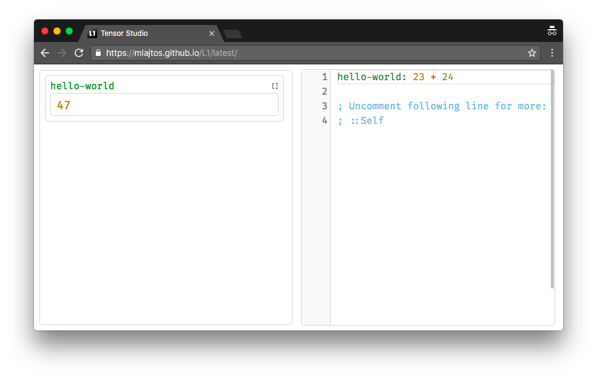

# L1: Tensor Studio
[L1: Tensor Studio](https://mlajtos.github.io/L1/latest/) is a live-programming environment for differentiable tensor computations. Think *playground for tensors*!

<a href="https://mlajtos.github.io/L1/latest/">Live Demo</a> | <a href="https://github.com/mlajtos/L1/tree/master/src/gallery">Examples</a> | <a href="https://github.com/mlajtos/L1/blob/master/src/components/Interpreter/modules/Documentation/doc.md">Documentation</a>

## ⚠️ Notice

- This project is still under-developed. Any feedback is welcome.

- L1 is for experienced programmers who are transitioning to the field of functional differentiable programming. And also for everybody else. 🙂

- L1 is **NOT** a replacement for any:
    - programming language – Python, Scala, Julia, ...
    - runtime – Tensorflow, Caffe, PyTorch, ...
    - IDE – VSCode, Jupyter, Vim, ...

    It's something completely different.

- Have fun :) 

# Thank you

Big thank you to these great projects and awesome people behind them:
- [TensorFlow.js](https://github.com/tensorflow/tfjs)
- [Ohm](https://github.com/harc/ohm)
- [Monaco Editor](https://github.com/Microsoft/monaco-editor)
- [FiraCode](https://github.com/tonsky/FiraCode)
- [React](https://github.com/facebook/react)
- [RxJS](https://github.com/Reactive-Extensions/RxJS)
- ...

This thing is stealing from:
- [APL family](https://en.wikipedia.org/wiki/APL_(programming_language)) – A, [J](https://en.wikipedia.org/wiki/J_(programming_language)), K, Q
- [LISP family](https://en.wikipedia.org/wiki/Lisp_(programming_language)) – ClojureScript
- [ECMAScript](https://en.wikipedia.org/wiki/JavaScript)
- [JSON](https://www.json.org/)
- [Haskell](https://en.wikipedia.org/wiki/Haskell_(programming_language))
- [Moniel](https://github.com/mlajtos/moniel) – prototype of L1
- [Douglas Crockford](https://www.youtube.com/watch?v=NPB34lDZj3E)
- ...