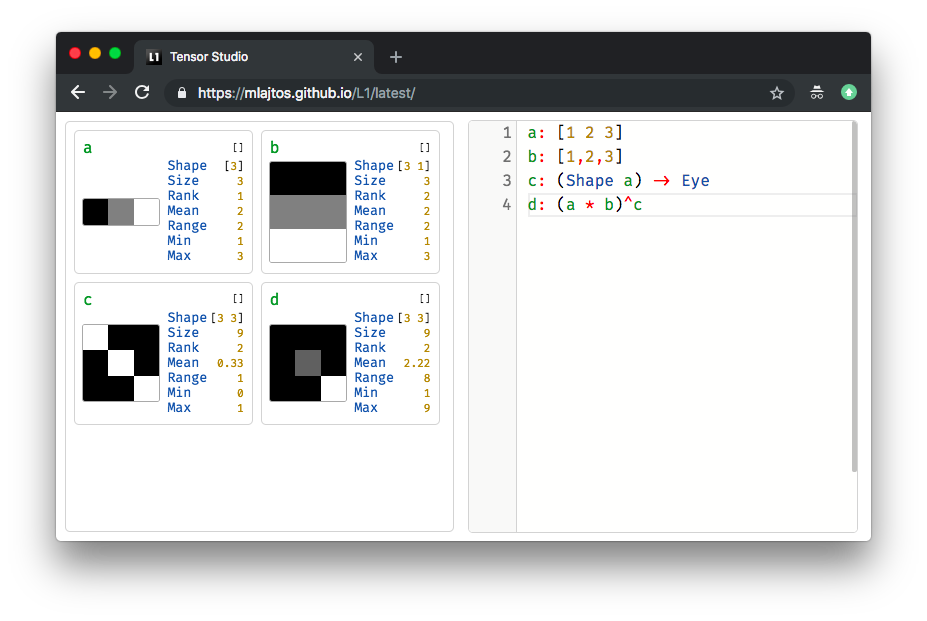

# L1: Tensor Studio
[L1: Tensor Studio](https://mlajtos.github.io/L1/latest/) is a live-programming environment for differentiable tensor computations. A playground for tensors.

<a href="https://mlajtos.github.io/L1/latest/">Live Demo</a> | <a href="https://github.com/mlajtos/L1/blob/master/src/components/Interpreter/modules/Documentation/doc.md">Documentation</a>

## About

L1 is a playground for differentiable linear algebra, heavily used in Machine Learning. The application is a combination of a programming language, runtime and IDE in one unified package.

### Goal

Become the standard tool for prototyping new Machine Learning ideas.

### Features
* designed for rapid learning and prototyping
* live visualization
* elegant functional language
* eager execution
* auto-broadcast for tensor operations
* GPU-accelerated computation
* awesome built-in documentation
* syntax-highlightning and code-completion

### Coming Soon
* variable tensors and optimisation
* richer set of tensor operators
* pre-trained models
* loading data
* etc.

**Note:** This project is still under-developed. Help and/or feedback is welcome. [Create new issue.](https://github.com/mlajtos/L1/issues/new)

---

## Thank you

Big thank you to these great projects and awesome people behind them:
- [TensorFlow.js](https://github.com/tensorflow/tfjs)
- [Ohm](https://github.com/harc/ohm)
- [Monaco Editor](https://github.com/Microsoft/monaco-editor)
- [FiraCode](https://github.com/tonsky/FiraCode)
- [React](https://github.com/facebook/react)
- [RxJS](https://github.com/Reactive-Extensions/RxJS)
- etc.

This thing is stealing great ideas from:
- [APL family](https://en.wikipedia.org/wiki/APL_(programming_language)) – A, [J](https://en.wikipedia.org/wiki/J_(programming_language)), K, Q
- [LISP family](https://en.wikipedia.org/wiki/Lisp_(programming_language)) – ClojureScript
- [ECMAScript](https://en.wikipedia.org/wiki/JavaScript)
- [JSON](https://www.json.org/)
- [Haskell](https://en.wikipedia.org/wiki/Haskell_(programming_language))
- [Moniel](https://github.com/mlajtos/moniel) – prototype of L1
- [Douglas Crockford](https://www.youtube.com/watch?v=NPB34lDZj3E)
- [Bret Victor](https://vimeo.com/36579366)
- etc.
