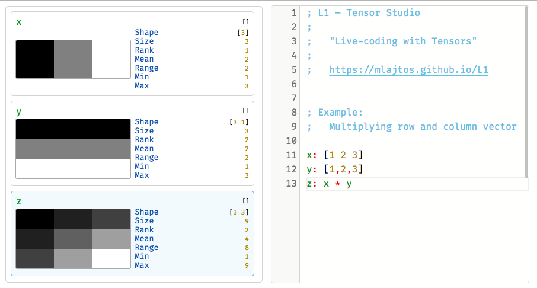

# L1: Tensor Studio

[L1: Tensor Studio](https://mlajtos.github.io/L1/latest/) is a live-programming environment for differentiable tensor computations.

[](https://mlajtos.github.io/L1/latest/)

## ⚠️ Notice

- L1 is meant to provide a bridge for programmers that are transitioning to the field of functional differentiable programming. Think *playground for tensors*.

- L1 is *NOT* meant as a replacement for real-world programming languages (Python, Scala, ...) or runtimes (Tensorflow, Caffe, ...)

- Have fun :)

# Syntax

## Comments

```L1
; This is a comment
```

1. Everything after a semicolon is a comment.
1. There are only single-line comments.
2. There **won't** be multi-line comments. Sorry.

## Assignment

```L1
a: 0
```

1. Yes, a colon. It's a name–value pair, a prop(erty).
1. Names can be in `camelCase`, `PascalCase`, `python_case`, `kebab-case`, `UPPERCASE`, `lowercase` or `FüčK3d_Úp-_cäšE-ಠ_ಠ`. Nobody cares.
1. Choosing good names is **your** responsibility.

## Numbers

```L1
a: 0
b: 1
c: -2
d: -3.14
e: 1_000
```

1. There are no *types*. It's just a numeric value.
1. If your numbers are too big, too small (or they aren't numbers at all), it is **your** problem.
1. Use underscores if you must.

### Tensors

```L1
scalar: 23
vector: [1 2 3]
matrix1: [1 2, 3 4]
matrix2: [
    1 2
    3 4
]
```

1. Only scalars, vectors and matrices.
1. If you want to *write* [14-dimensional tensor](quote.png) by hand, you have a problem. Please seek help immediately.
1. Of course you can reshape any tensor however you like.

## Operators

```L1
a: 1 + 2               ; 3
b: 2 - 1               ; 1
c: 1 + 2 * 2           ; 1 + 4
d: 2 * 3 / 6           ; 1
e: 3 * 2 ^ 2 + 1       ; 3 * 4 + 1
f: (3 * 2) ^ (2 + 1)   ; 6^3
```

1. Natural order of operations. You got this!
1. Applicable to tensors of all sizes (auto broadcast).
1. There are some fancy operators.

```L1
a: [1 2 3] × 3   ; [1 2 3] * [3 3 3]
b: [3 6 9] ÷ 3   ; [3 6 9] / [3 3 3]
c: [1 2 3] % 2   ; [1 2 3] % [2 2 2]

; matrix multiplication
d: [1 2, 3 4] ⊗ [1 2, 3 4]   ; [1 2, 3 4] @ [1 2, 3 4]
```

## Function Application

```L1
a: Fn 23                    ; Fn(23)
b: Fn2 Fn1 47               ; Fn2(Fn1(47))
c: (higher-order-fn Fn) 47
d: Fn!                      ; Fn()
```

1. There is only one argument.
1. The argument does not have to be in parenthesis.
1. Use parenthesis to group expressions together.
1. Use `()` or `!` to call function without an argument.

### Pipeline

```L1
a: 23 -> Fn             ; Fn 23
b: 23 -> Fn1 -> Fn2     ; Fn2 Fn1 23
c: [1 2, 3 4] -> Fn1
d: [1 2, 3 4]
    -> Fn1
    -> Fn2
```

1. Pipeline is a function application with the reversed order.
1. Pipeline can turn nested expression into a linear one.
1. It can be written as `->`, `//` (Mathematica), `|` (Unix pipe), or `|>` (F# and others).

## Objects

```L1
Obj1: {
    x: 1
    y: 2
}
Obj2: { x: 1, y: 2}
```

1. Objects hold name–value pairs, prop(ertie)s.
1. Child object can refer to parent props directly.
1. Dot `.` operator works.
1. Shorthand notation for `abc: abc` is `::abc`. Also works for paths.

```L1
A: {
    x: 1
    B: {
        y: x + 1
    }
}
z: A.B.y  ; z: 2
```

```L1
y: {
    x: 2
    value: x * 3
}.value
```

```L1
A: {
    i: 23
    B:  {
        j: 47
    }
    C: {
        ::i     ; i: i
        ::B.j   ; j: B.j
    }
}
```

## Functions

```L1
Fn: x => x^2
a: Fn 3
```

1. There is only one argument.
1. Higher-order functions are okay.

```L1
Fn: x => {
    linear: x
    quadratic: x^2
    cubic: x^3
}
A: Fn 3

; A: {
;     linear: 3
;     quadratic: 9
;     cubic: 27
; }
```

```L1
Fn: x => y => x + y     ; higher-order function
a: (Fn 2) 3
b: 3 -> (2 -> Fn)
c: 3 -> (Fn 2)
d: (2 -> Fn) 3
```

```L1
Fn: A => {
    z: A.x + A.y
    value: z^2
}.value

a: Fn {
    x: 1
    y: 2
}
```

```L1
Flip: S => {
    a: S.b
    b: S.a
}

mu: { a: 0, b: 1 }
    -> Flip
    -> Flip
    -> Flip
```

## IIFE

```L1
iife1: 22 -> a => a + 1
iife2: (a => a + 1) 22
```

## Functional Objects

1. Object can be used as a function.
1. Good for many things, mostly encapsulation.
1. Can have documentation attached.

```L1
fn: {
    #call: a => a + 23
    #doc: "Adds 23 and the provided *value*"
}

test: fn 24
```

## Not mentioned elsewhere

## Examples

There are a few [examples](https://github.com/mlajtos/L1/tree/master/src/gallery). Most of them are broken, here are the working ones:

- [Intro](https://github.com/mlajtos/L1/blob/master/src/gallery/1_intro.l1)
- [Gallery of Activation Functions](https://github.com/mlajtos/L1/blob/master/src/gallery/3_gallery.l1)
- [Closures](https://github.com/mlajtos/L1/blob/master/src/gallery/21_closures.l1)
- [Range](https://github.com/mlajtos/L1/blob/master/src/gallery/26_range.l1)
- [Logo](https://github.com/mlajtos/L1/blob/master/src/gallery/16_logo.l1)
- [Nested](https://github.com/mlajtos/L1/blob/master/src/gallery/17_nested.l1)

But see the broken ones for some *really cool shit*. Due to rewrite of the interpreter, it will take some time to get them working again. 

Meanwhile, PRs are welcome, code is horrible and you've been warned! :)

### Self

Top-level prop `Self` contains everything that is available by default, something like "standard library".

```L1
:: Self
```

### Silent assignment

```L1
_a: 23
_b: 24
c: a + b
```
1. Use underscore `_` in front of an assignment, to silence it.
1. (Therefore, no names with leading `_`, yay!)
1. Values still exist and can be used – they are just not displayed.

### None

Expressions `()` and `!` (and top-level prop `None`) have value that is equivalent of `None` in Python or `undefined` in Javascript. It is useful when calling a function that does not need an argument.

```L1
a: ()
b: !
c: None
```

### Booleans

There are top-level props called `False` and `True`. There is no use for them yet.

### Strings

There is rudimentary support for strings. However, no concatenation, no interpolation, no manipulation. They are necessary for documentation right now.

### Symbols

Following example shows two assignments. First is a normal prop – string as a key, second is a symbol prop – symbol as a key:
```L1
mu: 2
#mu: 2
```

Symbol props are not displayed (silenced by default), and have a special purpose. For example, `#call` is used when object is used as a function in function application. `#doc` holds a Markdown documentation for the object.

There is also a `#meta` prop, that is used internally to do various stuff:

```L1
mu: {
    a: 23
    _b: 47
}

meta: mu.#meta
```

Symbol props can store any values and can be accessed in the same way as a normal props.

### Force evaluate
By default, every input triggers evaluation of the code, to force-evaluate use <kbd>Ctrl+Enter</kbd> or <kbd>Cmd-Return</kbd>.

# Thank you

This project would not exist without people behind the following projects:
- [TensorFlow.js](https://github.com/tensorflow/tfjs)
- [Ohm](https://github.com/harc/ohm)
- [Monaco Editor](https://github.com/Microsoft/monaco-editor)
- [FiraCode](https://github.com/tonsky/FiraCode)
- [React](https://github.com/facebook/react)
- [RxJS](https://github.com/Reactive-Extensions/RxJS)
- [Moniel](https://github.com/mlajtos/moniel)

...and many other people.