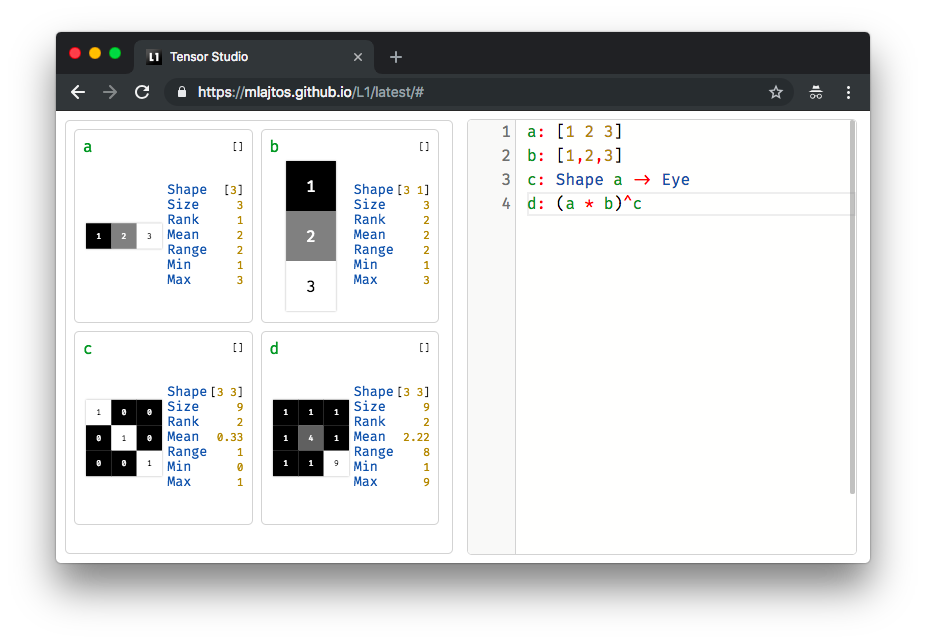

# L1: Tensor Studio
[L1: Tensor Studio](https://mlajtos.github.io/L1/latest/) is a live-programming environment for differentiable linear algebra. The playground for tensors.

<a href="https://mlajtos.github.io/L1/latest/">Live Demo</a> | <a href="https://mlajtos.github.io/L1/latest/#OjpTZWxm">Documentation</a> | <a href="https://github.com/mlajtos/L1/tree/master/src/gallery">Examples</a>

## About

L1 is a playground for differentiable linear algebra, heavily used in Machine Learning. It frees your mind from accidental complexities of programming, and lets you focus your attention on the underlying math to further strengthen your intuition.

### Goal

Become the standard tool for prototyping new Machine Learning ideas. [More...](GOAL.md)

### Features
* designed for rapid learning and prototyping
* helpful live visualization
* elegant pure functional language
* eager execution
* auto-broadcast for tensor operations
* fast GPU-accelerated computation
* awesome built-in documentation
* syntax-highlighting and code-completion

### Changelog

* [August 2018](CHANGELOG.md#august-2018)

### What's comming?
* variable tensors and optimization
* richer set of operators
* pre-trained models
* loading data, I/O
* [etc.](https://github.com/mlajtos/L1/blob/master/TODO.md)

### Issues
* None of the mobile browsers are supported
* Firefox is rather slow and has unpredictable behavior – [#3](https://github.com/mlajtos/L1/issues/3)
    * please use Chrome for best experience
* Edge looks visually off, but works OK

### Contribution

Any form of help and feedback is welcome – including [PRs](CONTRIBUTING.md), [reporting bugs](https://github.com/mlajtos/L1/issues/new), [suggesting ideas](https://github.com/mlajtos/L1/issues/new), [shooting down existing ideas](TODO.md), [creating new examples](https://github.com/mlajtos/L1/tree/master/src/gallery), promotion, testing, etc.

This project is under [MIT license](LICENSE).

---

## Thank you

Big thank you to these great projects and awesome people behind them:
- [TensorFlow.js](https://github.com/tensorflow/tfjs)
- [Ohm](https://github.com/harc/ohm)
- [Monaco Editor](https://github.com/Microsoft/monaco-editor)
- [FiraCode](https://github.com/tonsky/FiraCode)
- [React](https://github.com/facebook/react)
- [RxJS](https://github.com/Reactive-Extensions/RxJS)
- etc.

This thing is stealing great ideas from:
- [APL family](https://en.wikipedia.org/wiki/APL_(programming_language)) – A, [J](https://en.wikipedia.org/wiki/J_(programming_language)), K, Q
- [LISP family](https://en.wikipedia.org/wiki/Lisp_(programming_language)) – ClojureScript
- [ECMAScript](https://en.wikipedia.org/wiki/JavaScript)
- [QML](https://en.m.wikipedia.org/wiki/QML)
- [JSON](https://www.json.org/)
- [Jsonnet](https://jsonnet.org/)
– [Ren](https://pointillistic.com/ren/)
- [Haskell](https://en.wikipedia.org/wiki/Haskell_(programming_language))
- [Smalltalk](https://en.wikipedia.org/wiki/Smalltalk)
- [Moniel](https://github.com/mlajtos/moniel) – prototype of L1
- [Douglas Crockford](https://www.youtube.com/watch?v=NPB34lDZj3E)
- [Bret Victor](https://vimeo.com/36579366)
- etc.
